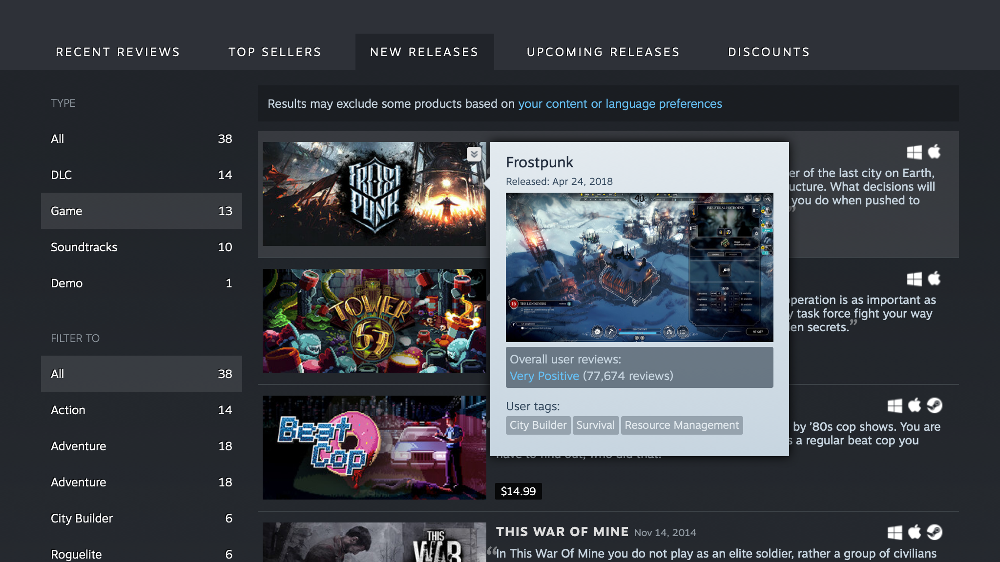
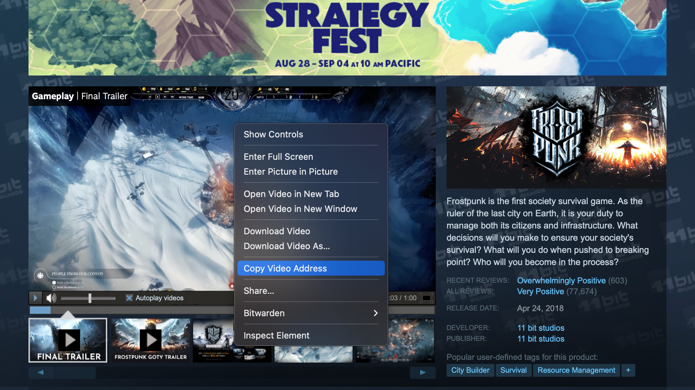

+++
title = "Preview Your Steam Micro Trailer"
date = "2023-08-31"
tags = ["Steam", "Marketing"]
+++

Steam micro trailers are six-second clips that get automatically generated from your uploaded videos. They get shown as part of the hover tooltip in certain pages, like fests. But how can you preview your micro trailer if you're not in a fest? Here's one easy way to do it.
{.lead}

<!--more-->



## Previewing your normal hover tooltip

Normal hover tooltips only show your **first four screenshots**. Previewing them is straightforward --- you can go to your developer page, scroll down, and hover over your game's capsule. For example, here's a screenshot of the normal hover tooltip for [Frostpunk](https://store.steampowered.com/app/323190/Frostpunk/), from [11 bit studios](https://store.steampowered.com/developer/11bitstudios):



## Previewing your micro trailer

Fancy hover tooltips in pages like fests behave slightly differently. They show a **six-second micro trailer** generated from your **first video**, followed by your **first ten screenshots**.

But how do you preview that micro trailer if you're not in a fest? First, you'll need to find out the URL for your first video. To do that, open your game's page in a browser, right click on your first video, and select "Copy Video Address" or similar.



You'll get a URL like this one:

```txt
https://cdn.akamai.steamstatic.com/steam/apps/256938862/movie480_vp9.webm?t=1685028532
```

Now take the last part that says `movie480_vp9.webm` or `movie_max_vp9.webm` or similar, and replace it with `microtrailer.webm`, so that you get a URL like this one:

```txt
https://cdn.akamai.steamstatic.com/steam/apps/256938862/microtrailer.webm?t=1685028532
```

Open it in your browser, and make sure it looks great!
