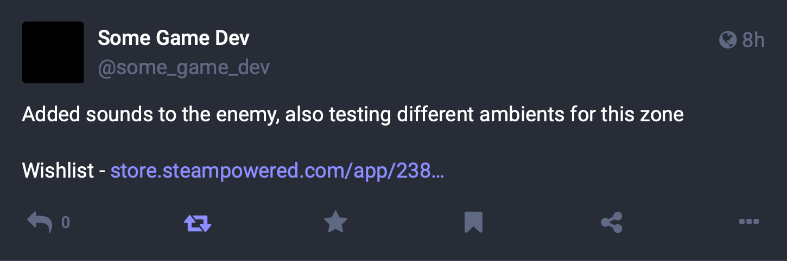

+++
title = "Short Steam Links"
date = "2023-08-15"
tags = ["Steam", "Marketing"]
+++

I was today years old when I found out that Valve have their own link shortener for the Steam platform, `s.team`.
{.lead}

<!--more-->

I'm used to seeing people promote their Steam games on social media by pasting super lengthy URLs like https://store.steampowered.com/app/413150/Stardew_Valley/, which inevitably end up truncated to something like `https://store.steampowered.com/app/413...`.

It turns out that Valve have their own link shortener, `s.team`. You can use it for two types of links:

- **Store page** --- [s.team/a/413150](https://s.team/a/413150)
- **Community hub** --- [s.team/c/413150](https://s.team/c/413150)

They look so much nicer! However, there are a couple of things to think about:

1. Most people are used to the `steampowered.com` domain, but they may have never seen `s.team`, and may not know it belongs to Valve. This means they might not trust the link enough to click on it.
2. Valve are gonna keep the `steampowered.com` domain around for a long time, because those links are _EVERYWHERE_. But that may not be the case for `s.team`, because it isn't even documented as far as I know. If they discontinue it, your links will break.

You'll need to decide what works best for you. I'll probably stick to long links for now. 🤓
