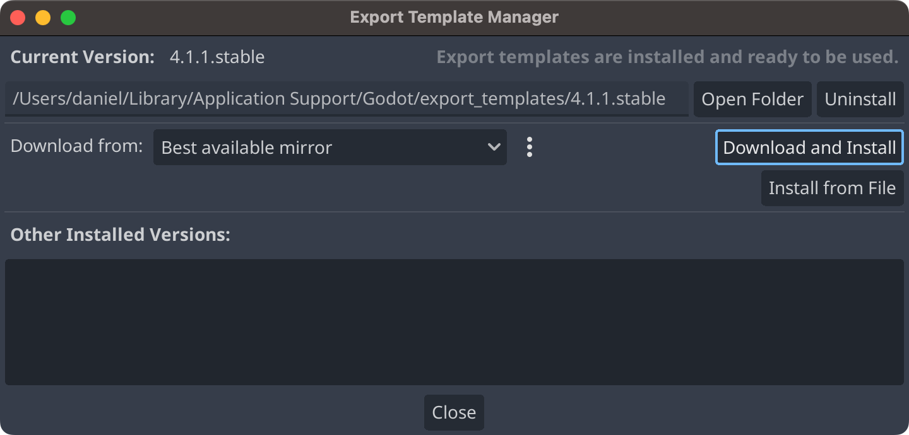
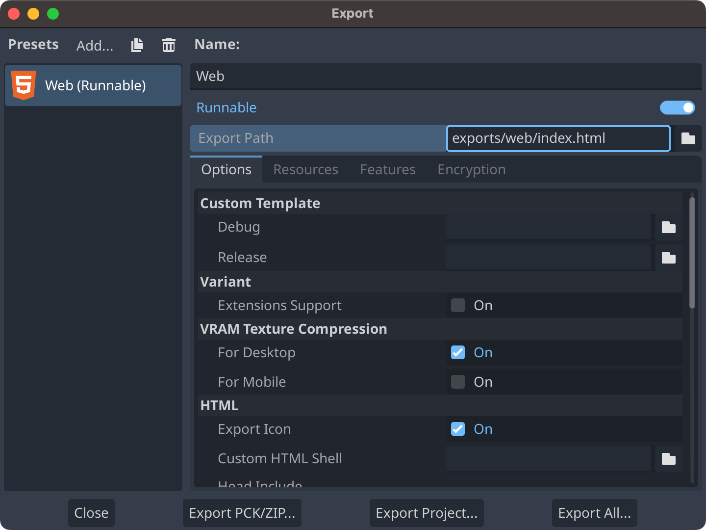
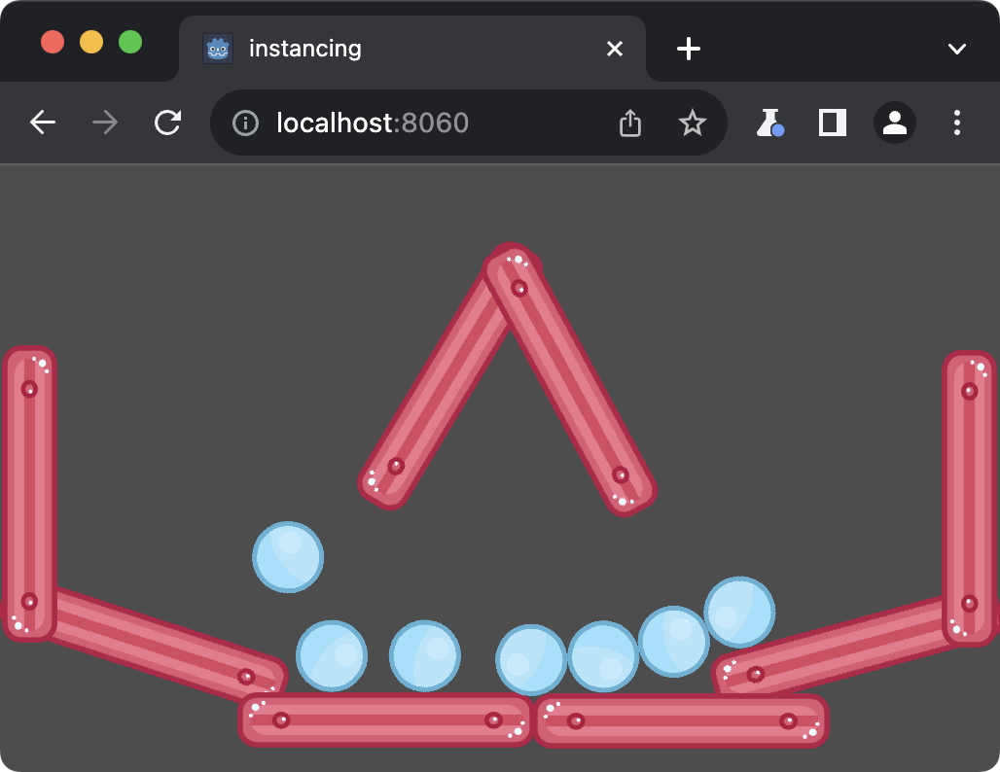

+++
title = "Test Your Godot 4 Web Build Locally"
date = "2023-09-13"
tags = ["Godot", "Web"]
+++

I was playing with Godot 4 today ([for no particular reason](https://blog.unity.com/news/plan-pricing-and-packaging-updates)), and wanted to test a web export locally, but encountered a cryptic error related to HTTP headers. It turns out I had missed an important callout in the official docs.
{.lead}

<!--more-->

## Getting the templates

As explained in the Godot documentation page [Exporting projects](https://docs.godotengine.org/en/stable/tutorials/export/exporting_projects.html), the first thing you'll need to do is install export templates for your version of Godot (`4.1.1.stable` in my case). If you click on **Editor > Manage Export Templates...** you'll see the screen below. Click on **Download and Install** to start the installation process.


{class="!rounded-none"}

## Web export

Once that's done, you should be able to click on **Project > Export...**, and add the **Web** preset.


{class="!rounded-none"}

Now click on **Export Project...**, and select a location for the HTML file and all other assets generated for your project. When Godot finishes exporting, you'll have something like this:

```
exports/web/
├── [ 12K]  index.apple-touch-icon.png
├── [7.0K]  index.audio.worklet.js
├── [6.4K]  index.html
├── [5.5K]  index.icon.png
├── [437K]  index.js
├── [ 24K]  index.pck
├── [ 21K]  index.png
├── [ 28M]  index.wasm
└── [6.5K]  index.worker.js
```

## A wild error appears!

Try opening the HTML file in your browser, and you'll see the following error:


{class="!rounded-none"}

What gives!? Well, the Godot documentation page [Exporting for the Web](https://docs.godotengine.org/en/stable/tutorials/export/exporting_for_web.html) does mention that web exports require support for [`SharedArrayBuffer`](https://developer.mozilla.org/en-US/docs/Web/JavaScript/Reference/Global_Objects/SharedArrayBuffer). It turns out that `SharedArrayBuffer` has special [security requirements](https://developer.mozilla.org/en-US/docs/Web/JavaScript/Reference/Global_Objects/SharedArrayBuffer#security_requirements), in that the browser will only let you use that API if your document is cross-origin isolated. This means that your HTML file needs to be served with these two HTTP headers:

- `Cross-Origin-Opener-Policy` set to `same-origin`
- `Cross-Origin-Embedder-Policy` set to `require-corp` or `credentialless`

When you opened the HTML file in your browser, it had no HTTP headers, so it wasn't cross-origin isolated, and Godot couldn't instantiate `SharedArrayBuffer`!


**Pro tip**

You can check whether a document is cross-origin isolated by looking at the value of `window.crossOriginIsolated` in the browser console.


## Serving the HTML file properly

Ok, so how do you fix this? There's a section in the Godot docs, [Serving the files](https://docs.godotengine.org/en/stable/tutorials/export/exporting_for_web.html#serving-the-files), that mentions a file [`serve.py`](https://raw.githubusercontent.com/godotengine/godot/4.1.1-stable/platform/web/serve.py) in the official repo that actually does what you need. Download it to your export folder, and run it:

```sh
cd <project>/exports/web
curl -O https://raw.githubusercontent.com/godotengine/godot/4.1.1-stable/platform/web/serve.py
python3 serve.py --root .
```

It will start a server at `http://localhost:8060`, and open that URL with your default browser. Great success!


{class="!rounded-none"}


**Update 2023-09-14 --- Project may take a long time to load with Chrome on macOS**

If you're testing with Chrome on macOS, you'll notice that the project takes forever to load. At the time of writing, Chrome on macOS by default uses a version of ANGLE that runs on top of OpenGL drivers, and is really slow at compiling shaders. You can double-check by opening `chrome://gpu` in a tab:

```
GL_RENDERER: ANGLE (Apple, Apple M1 Max, OpenGL 4.1 Metal - 83.1)
```

If you want to switch over to ANGLE running on top of Metal for testing, you can start Chrome with these flags:

```
/Applications/Google\ Chrome.app/Contents/MacOS/Google\ Chrome --use-cmd-decoder=passthrough --use-angle=metal --user-data-dir=/tmp/chrome
```

Check `chrome://gpu` there, and you'll see the difference:

```
GL_RENDERER: ANGLE (Apple, ANGLE Metal Renderer: Apple M1 Max, Version 13.4.1 (c) (Build 22F770820d))
```

You can read more at [godotengine/godot#70691](https://github.com/godotengine/godot/issues/70691).

