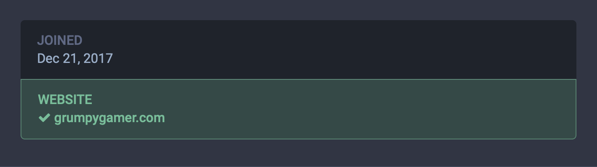
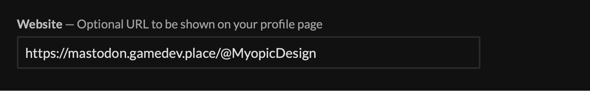
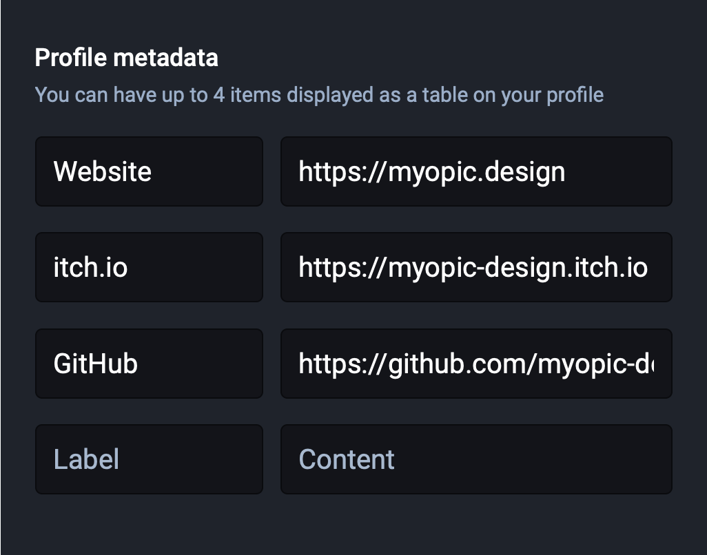
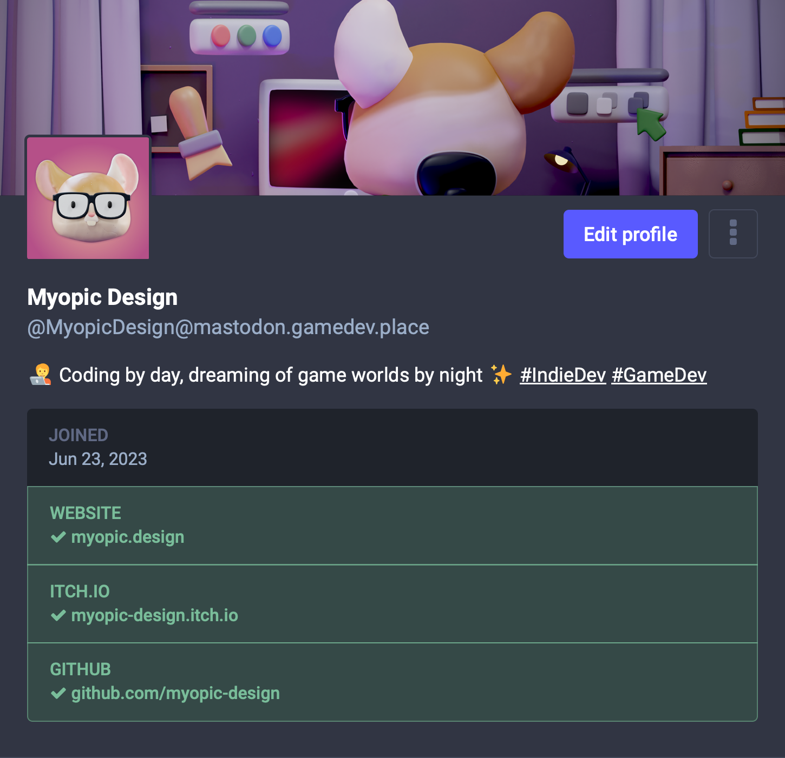

+++
title = "Verify an itch.io Link on Your Mastodon Profile"
date = "2023-08-07"
tags = ["itch.io", "Social Media", "Marketing"]
+++

In the world of indie game development, establishing trust and authenticity can go a long way in building a dedicated following. One small thing you can do to elevate your credibility is to add a verified itch.io link in your Mastodon profile.
{.lead}

<!--more-->

## Understanding verification on Mastodon

Mastodon can cross-reference the links you put on your profile, to prove that you are the real owner. It does so by checking if the linked pages link back to your Mastodon profile with a special [`rel=me`](https://developer.mozilla.org/en-US/docs/Web/HTML/Attributes/rel/me) attribute. Once a link is verified, most clients will render it with a green checkmark next to it.

You can read more about this topic in the [official docs](https://docs.joinmastodon.org/user/profile/#verification).

## Updating your itch.io profile

If you want the link to your itch.io page to show up as verified, you need to somehow trick itch.io into rendering a `rel=me` link in your profile page linking back to your Mastodon page. You can do so by temporarily setting the *Website* field of [your itch.io settings page](https://itch.io/user/settings) to your Mastodon URL (in my case `https://mastodon.gamedev.place/@MyopicDesign`):

Make sure to hit the *Save* button at the bottom of the page.

## Updating your Mastodon profile

You can now edit [your Mastodon profile metadata](https://mastodon.gamedev.place/settings/profile), and add the link to your itch.io page:

Hitting the big *Save changes* button will cause Mastodon to cross-check your links, and your itch.io link will be verified!

Now you can change the value of the *Website* field on itch.io back to whatever you want --- the link on your Mastodon profile will stay verified.
